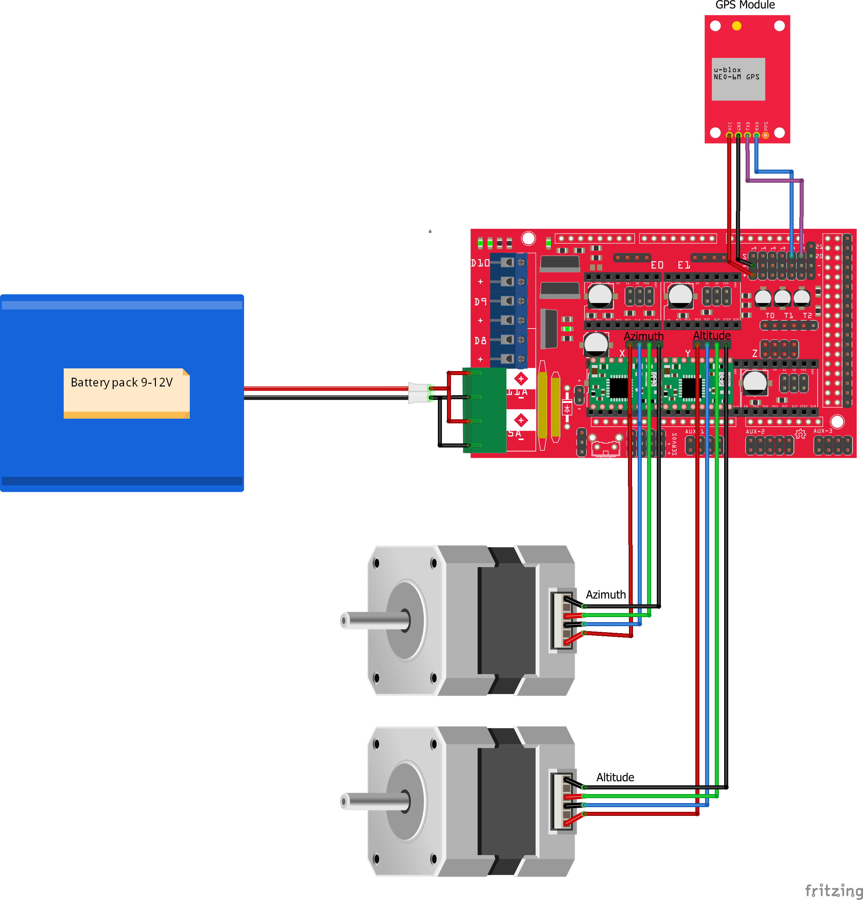
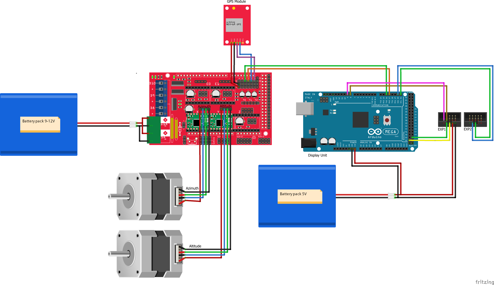

# dobson-star-tracker
This project aims to enable makers to motorize their dobson-style mounted telescopes using easily sourced hardware.

## Hardware

+ 2 Stepper Motors + drivers. I found that the size of my telescope (as pictured badly below) requires at least NEMA 17 with 1.2A current per phase. The altitude motor uses a (roughly) 5:1 gear ratio
+ Arduino with at least 6 Digital Pins. The instructions and example config work for an Arduino Mega with a RAMPS 1.4 shield
+ 3D printed motor mounts and gears
+ Optional: Two Buttons; Each requires one additional digital pin
+ Optional: A GPS module; Requires either a free TX/RX pin pair or two digital pins

## 3D Files

The printable files (stl and step format) can be found at: https://www.thingiverse.com/thing:3851307

## Installation

First of all, you will need the [Arduino IDE](https://www.arduino.cc/) and a few libraries:

* [TimerOne (on the Arduino Mega)](https://github.com/PaulStoffregen/TimerOne)
* [DueTimer (on the Arduino Due)](https://github.com/ivanseidel/DueTimer)
* [AccelStepper](https://www.airspayce.com/mikem/arduino/AccelStepper/)
* [FuGPS (currently, even if no GPS module is installed)](https://github.com/fu-hsi/FuGPS)
* [TimeLib](https://github.com/PaulStoffregen/Time)

Clone or download this repository and open the dobson-star-tracker.ino file in the Arduino IDE. Then you will need to set up a few constants in the config.h file. Have a look at the DEBUG_* constants in config to get some output in the console. Then just have to build and upload the sketch. If the sketch builds and uploads, you can connect the telescope to Stellarium, use the display unit (if you have one) to control the telescope or simply use the Serial Monitor.

## Connection to Stellarium

There are a few requisites for establishing a connection between the telescope and Stellarium.

### Arduino project
1. Set the `SERIAL_BAUDRATE` to 9600
2. Disable all of the DEBUG constants, so that the telescope does not send invalid commands to Stellarium. If Stellarium receives an invalid answer, it will wait for a few seconds before interacting with the telescope again. This either means, that it won't receive position updates from the telescope or that it won't send your commands. Setting a new position requires three commands sent by Stellarium. If one of them receives an invalid answer, Stellarium will not send the rest of the commands and your input will basically be ignored.
3. Close the Serial Monitor or Stellarium will not be able to connect to the telescope
4. 
### Settings in Stellarium
1. Open Stellarium and locate the "Telescope" tab. It should be in the lower control bar to the left of the time controls. If you can't find it, you may need to enable the "Telescope Control" plugin and restart Stellarium. Do so in the Configuration window in the last tab.
2. Click "Add" and set the following:
    * **Telescope controlled by:** "Stellarium, directly through a serial port"
    * **Name:** Choose one :)
    * **Connection delay:** Something around 0,1s, but should not matter too much
    * **Coordinate System:** J2000 (default)
    * **Start/Connect at startup:** Ticking the box means that Stellarium will try to connect to the telescope as soon as you open it. Use your preference.
    * **Serial port:** Select the same port as in your Arduino IDE
    * **Device Model:** Meade LX200 (compatible)
    * **Use field of view indicators:** Does not matter for controlling the telescope. Use your preference.
3. Confirm the settings with "OK"
4. Use "Start" to connect to the telescope
5. Wait a few seconds for it to show up on the screen
6. **Imporant:** I haven't figured out how I want aligning the telescope to work. For now, this will do, but please add suggestions to the issue I have opened for this.
    1. Turn off the power supply to the steppers
    2. Manually point the telescope at a star
    3. Select that star in Stellarium
    4. Click "current object" in the telescope section
    5. Click "slew" and wait for the telescope on screen to point at the correct star
    6. Reconnect the stepper driver power supply
    7. The telescope will know where it is actually pointing at
7. Select a star
8. Click "current object" in the telescope section
9. Click "slew" and watch the telescope move

## Wiring a RAMPS1.4

## Wiring with the Display Unit

My example uses a version of the well-known [RepRap Discount Full Graphics Smart Controller](https://reprap.org/wiki/RepRapDiscount_Full_Graphic_Smart_Controller). The only connection between the two Arduino boards is via the two cables connected to RX2 and TX2 on the Display Unit. For more information + code for the display unit head over to [ThisIsJustARandomGuy/telescope-display-unit/](https://github.com/ThisIsJustARandomGuy/telescope-display-unit/).

## Serial Commands

+ :HLP# Print available Commands
+ Commands used by stellarium (you can use them as well)
  + :GR# Get Right Ascension
  + :GD# Get Declination
  + :Sr,HH:MM:SS# Set Right Ascension; Example: :Sr,12:34:56#
  + :Sd,[+/-]DD:MM:SS# Set Declination (DD is degrees) Example: :Sd,+12:34:56#
  + :MS# Start Move
  + :Q# Quit Move (Not Implemented)
+ Other commands
  + :TRK0# Disable tracking. This sets the telescopes isHomed member variable to false, so the motors stop moving
  + :TRK1# Enable tracking. The telescope will track whatever the target is
  + :STP0# Disable steppers permanently
  + :STP1# Enable steppers (after they were disabled using the STP0 command)
+ Debug commands
  + :DBGDSP# Send a status update to the display unit
  + :DBGDM[00-99]# Disable Motors for XX seconds
  + :DBGM[0-9]# Move to debug position X (see conversion.cpp; Later we will have a separate file with a star catalogue)
  + :DBGMIA# Increase Right Ascension by 1 degree
  + :DBGMDA# Decrease Right Ascension by 1 degree
  + :DBGMID# Increase Declination by 1 degree
  + :DBGMDD# Decrease Declination by 1 degree

## TODOs

The Most important TODOs are as follows (in no particular order)
+ Documentation
+ Equatorial Mounts: Adding equatorial mounts would be rather easy, but I don't own one so it's difficult to test. Maybe someone is interested in providing a PR?
+ Board compatibility: Out-of-the-box support for Arduino Mega and Arduino Due with their respective RAMPS shields (Mostly done, Mega + RAMPS 1.4 and Due + modified RAMPS 1.4 work)
+ Time keeping: Handle big swings which could happen due to GPS issues
+ EEPROM: Store time and location in EEPROM (Mega) or Flash (Due); Provide a simple API for doing so
+ Motor control: Turn On/Off permanently. Off for X seconds is already implemented as :DBGDM[00-99]#
+ SD card support: Loading a star atlas from a sd card (preferrably connected to the display unit, but direct connection should be possible too)